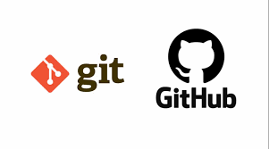

# Nome do seu projeto
> Um resumo curso sobre o que o seu projeto faz (um resumo curto, 1 ou 2 linhas). Exemplo: "Um projeto de e-commerce utilizando Python e React".  

Um ou dois parágrafos sobre o seu projeto e o que ele faz.



## Instalação (pacotes ou extenções que são necessarias para executar o projeto)

Mac OS X & Linux:

```sh
npm install --save
```

Windows:
```sh
edit autoexer.bat
```

## Exemplo de uso

Alguns exemplos que motivariam as pessoas a utilizarem seu projeto ou que demonstrasse que este é útil para alguma coisa. Divida esta parte em partes menores e se possível, coloque algum código ou prints de telas.


## Ambiente de Desenvolvimento

Descrever como instalar e preparar qualquer dependência de desenvolvimento para que seu projeto possa ser executado localmente e pessoas possam contribuir com o mesmo. Se possível forneça as informações para diferentes plataformas, exemplo Windows, Linux e Mac OS.

## Histórico de Atualizações (do maior para o menor)

* 0.2.1
    * CHANGE: Atualização dos docs (o código não foi alterado)

* 0.2.0
    * CHANGE: Removida a função `setPadrãoXYZ()`
    * ADD: Adicionado a função `inicializar()`

* 0.1.1
    * FIX: Crash quando executava `escrever()` (Obrigado ao @Contribuidor)

* 0.1.0
    * O primeiro lançamento estável
    * CHANGE: Renomeado de `Projeto XYZ` para `Projeto ABC`

* 0.0.1
    * Projeto inicial

## Meta

Seu nome - [@SeuTwitter](https://twitter.com/seuTwitter) - seuEmail@gmail.com
Distribuído sobre a licença. Veja `LICENÇA` para mais informações.
[https://github.com/BiancaBispo/curso-git-github](https://github.com/BiancaBispo/curso-git-github)